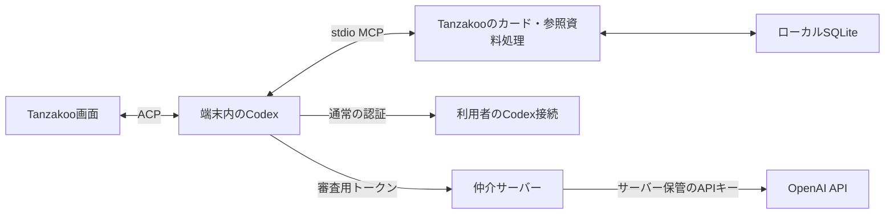

# ストア審査用の仲介サーバーとMac App Storeの検討

2026-09-27。ユーザーは審査用接続の方向性に賛同し、Mac App Storeも視野に入れて検討を進めるよう依頼した。その後の「やれるとこまでやってみて」を受け、下記「ローカル実装と検証結果」まで進めた。ホスティング、課金、公開、ストア提出は未決定・未実施。以下の設計全体を実装済みと扱わない。

## ローカル実装と検証結果（2026-09-27）

[審査用仲介パッケージ](../packages/review-relay/README.md)と `mise exec -- pnpm test:review` を追加した。Fastify 5.12.5・eventsource-parser 4.1.1をサーバー専用に採用し、固定NodeのSQLiteで期限・失効・モデル・利用回数を管理する。アプリの同梱ランタイムの依存や起動設定は変更していない。

Windowsで、サーバーの境界テスト9件と実Codex・ACPの接続テスト3件が通過した。gateway認証とproviders APIの双方で、空の認証領域からローカル仲介を経由してストリーム応答を取得できた。実TanzakooのMCP・SQLiteで候補作成と変更提案を確認し、本文が変わらず提案が `pending` のままであることも検証した。プロセス再起動後のセッション復元、資格情報がCodex保存領域に残らないことも確認した。

接続テストは実アプリと同じ `INITIAL_AGENT_MODE=read-only` で実行する。これを省いた初期テストでは、アダプターの既定モードが別モデルによる自動承認審査を呼び、単一モデルを許可する仲介に拒否された。テストの起動条件を実アプリへ合わせて解消した。通常のMCP許可ポリシーは変更していない。

残っているのは、審査用UI・送信先同意・資格情報の保存と更新、金額単位の予算制御、実APIと長い会話の検証、公開先の決定、MacのSandbox実機検証。現サーバーは回数・入力サイズ・出力トークン数の制限であり、金額上限の保証はない。APIキー、クラウド契約、公開URLを用意したり、有料APIを呼んだりはしていない。

MacのCIにも同じオフライン検証を追加したが、この作業中にpushやCI実行は行っておらず、Macでの通過は未確認。通常のMacプロセスで通過しても、Store署名・App Sandbox内の起動・ブラウザ認証・参照資料の許可を確認した証拠にはしない。

## 推奨する構成

**端末内のCodex・ACP・MCPを維持し、審査用の認証でモデル通信だけを仲介する案を先に検証する。** 通常利用は利用者自身のCodex認証、審査では開発者負担のAPI利用とする。審査用接続を停止しても通常接続やローカルのカード編集には影響させない。

会話・起票・変更提案・ユーザーによる承認・保存は共通とし、モデルの接続先と費用負担を切り替える。審査用アカウントで実際のAIと操作できる構成を目指す。モデルや利用可能な設定が通常接続と完全に一致するとは限らず、その差は明示する。

| 案                                    | 共通化できる処理           | 追加負担                                               | 判断                                   |
| ------------------------------------- | -------------------------- | ------------------------------------------------------ | -------------------------------------- |
| 端末のCodexからモデル通信を仲介       | 現行のACP・MCP・履歴・承認 | 接続設定、審査認証、API中継                            | 第一候補                               |
| サーバーでCodexを動かす               | 一部のエージェント処理     | 端末へのツール呼び出し、利用者分離、遠隔セッション管理 | 今回は選ばない案                       |
| アプリからAPIを直接操作する別エンジン | UI・保存・ツールの業務処理 | ストリーム、ツール実行ループ、履歴・中断の別実装       | 同梱CodexがMacで成立しない場合に再検討 |

Mac App Storeの可能性は広がるが、仲介だけでSandbox対応が済むわけではない。DMGを既定のMac配布として維持し、ストア版は技術検証の結果から判断する。

## 現在の実装から確認できたこと

調査対象は `@agentclientprotocol/codex-acp 1.11.0`、ロック済みCodex `0.153.4`、Rustの `agent-client-protocol 2.1.0`。最新ドキュメントの機能が固定バージョンで動くとは限らない。

| 箇所                                                   | 現状と設計への影響                                                                                                                                                     |
| ------------------------------------------------------ | ---------------------------------------------------------------------------------------------------------------------------------------------------------------------- |
| `packages/agent-runtime/codex.mjs`                     | 外部のAPIキー、接続先、`CODEX_CONFIG`等を除去して固定の参照ポリシーを設定する。シェル環境を書き換えるだけでは審査接続を追加できない                                    |
| インストール済みACPアダプターのREADME・`dist/index.js` | gateway認証と `providers/list`・`providers/set`・`providers/disable` がある。接続先とヘッダーをCodexのカスタムプロバイダーへ変換する実装を確認。通信・認証成立は未検証 |
| RustのACP依存                                          | 型付きproviders APIは `unstable_llm_providers` featureの対象。現在のCargo設定では有効化していない。既存gateway認証との比較を先に行う                                   |
| `src-tauri/src/agent_setup.rs`                         | 接続確認とChatGPTログインが中心。審査トークンの確認・失効・表示を別の認証状態として扱う必要がある                                                                      |
| `src-tauri/src/agent/session.rs`                       | 同じCodex用の保存セッションIDを復元する。接続方式・資格情報の区別を加え、通常と審査のセッションを混ぜない                                                              |
| `src-tauri/src/projects.rs`                            | 送信同意はエージェントID単位。仲介を使う場合は送信先・説明の版も同意に結び付ける必要がある                                                                             |
| `src-tauri/src/agent.rs`                               | MCPは本体実行ファイルを `--mcp` で再起動するstdio子プロセス。サーバーへMCPを公開する構成ではない                                                                       |
| `src-tauri/Entitlements.sandbox.plist`                 | Sandboxとユーザー選択ファイルの読み書きのみ。通信や子プロセスの配布設定は未完成                                                                                        |
| `src-tauri/src/store/materials.rs`                     | 参照資料は文字列パスを保存する。Sandboxでの永続アクセス・別プロセスへの許可の受け渡しは未実装                                                                          |

OpenAI公式資料ではカスタムプロバイダーのURL・認証・Responses APIの設定が説明されている。[カスタムプロバイダー](https://learn.chatgpt.com/docs/config-file/config-advanced)、[認証方式](https://learn.chatgpt.com/docs/auth)。この調査で、Tanzakooから実APIへの接続やモデル呼び出しは行っていない。

## 審査用接続の設計案

### アプリと認証

- 接続設定に「審査用接続」を明示し、渡された審査用資格情報を入力する。隠し操作や審査員の自動判定は使わない。通常の無料機能を解除するライセンスキーとして扱わない。
- 審査用資格情報を仲介サーバーで検証し、失効可能な短命の接続トークンに交換する。アプリへ本物のOpenAI APIキーを渡さない。保存が必要な資格情報はOSの資格情報ストアを第一候補とし、既存依存の対応を実装前に確認する。
- 固定アダプターのgateway認証またはproviders APIを利用する。後者は認証状態とルーティングを別々に報告するため、「設定済み」と「有効な審査資格情報」を混同しない。空の認証領域から会話できることを採用条件にする。
- 起動ラッパーの環境除去と参照ポリシーを維持する。必要ならアプリ管理の入力経路だけ追加し、外部の任意プロバイダーやコマンドを一括で受け入れない。
- 通常／審査の資格情報・Codex保存領域・会話セッションを分離する。切り替えは処理終了後、新しい会話から行う案を推奨する。既存履歴を新しい送信先へ自動再送しない。
- 仲介の運営者にも会話・カード・メモリ・読んだ参照資料が通過することを接続前に説明し、その経路への同意を得る。既存のOpenAI送信同意だけで済ませない。
- 認証とモデル設定の確認にはボードや参照資料を送らない。モデル選択は接続先の許可モデルとACPの対応設定から作り、通常接続の一覧をそのまま流用しない。

### 仲介サーバーの責務

審査用資格情報の管理、上流APIへの認証、利用制限、通信の転送に絞る。カードの正本、変更承認、参照資料のアクセス制御は端末側で保持する。

- HTTPSで提供し、上流のURLをサーバー側で固定する。転送できるAPIとモデルは許可リストで制限する。利用者が任意のURLや組織・プロジェクトを選べる汎用プロキシにはしない。
- 最初の検証はResponses APIのストリーム転送を対象にする。ツール呼び出し・結果、停止、再試行、長い会話の圧縮で必要になるAPIを固定Codexで調べ、確認したものだけ追加する。WebSocketの要否もこの時点で確定し、単純なJSON転送だけで完成とは扱わない。
- 審査ごとに資格情報を発行し、有効期間、許可モデル、同時実行数、リクエスト頻度、入力・出力量、累積予算をサーバーで管理する。具体的な金額と期間は実測後に決める。
- 同時リクエストでも上限を超えないよう、利用枠を転送前に予約して使用量で精算する。切断して使用量が取得できない処理を無料扱いで枠へ戻さない。再試行による追加課金も枠に含める。
- 失効・期限切れ・上限超過・上流障害を区別して返す。端末は本文や既存カードを失わず、接続を見直せる。通信の再送でカード作成が重複しないことも検証する。
- 会話本文・参照資料・資格情報を通常ログに記録しない。監視はリクエストID、状態、時間、使用量を基本にする。例外ログ、ホスティング側ログ、アダプターのデバッグ出力にも適用する。「仲介で保存しない」と「上流で保存されない」は区別し、後者は利用APIのデータ保持条件を別途確認する。
- 上流APIキーは専用プロジェクトのものをサーバーのSecretとして保持する。開発者個人のChatGPTログイン情報は審査員や仲介へ配布しない。

ホスト製品は未選定。候補はHTTPSのストリーム転送と切断伝播が可能な小規模サービス。最大処理時間、応答バッファリング、同時実行時の予算管理、秘密情報の保存、再開手順を確認してから選ぶ。新しいクラウド契約や有料プランは今回追加しない。

### 有効期間と再審査

資格情報を提出前に有効化し、審査継続中は有効性と残量を確認する。予定日を過ぎても審査が続く場合は失効前に延長する。完了後は失効でき、次の更新では再発行する。公開後の追加確認にも対応できる連絡先・再開手順を残す。

初期運用では、待機時の負担が小さいホストを使い、資格情報の有効期間で利用を制限する案を推奨する。サーバー自体を停止する運用を選ぶ場合も、ソース・設定・発行台帳から再開できるようにする。審査用接続の停止が一般利用者のAI接続を止める設計にはしない。

## Mac App Storeで先に確かめること

AppleはMac App StoreにApp Sandbox等の要件を設けている。同梱ランタイムがあるだけで不可とは断定できないが、現在のDMGの署名・公証実績をSandbox動作やStore承認の証拠にはできない。[Apple 2.4.5](https://developer.apple.com/app-store/review/guidelines/#hardware-compatibility)

| 検証項目             | Tanzakooでの論点・合格条件                                                                                                                                              |
| -------------------- | ----------------------------------------------------------------------------------------------------------------------------------------------------------------------- |
| 本体と同梱ランタイム | Store用署名・プロファイルで本体→Node→Codexを起動し、コンテナ内へ認証・セッションを書ける。NodeのJIT、Codexが使う追加プロセスも列挙して検証する                          |
| MCP子プロセス        | 本体の自己再起動が適切にSandboxを引き継げるか検証する。継承用の別helperが必要なら、UI本体と同じentitlementsを一律に適用せず、共通Rust処理を使う専用バイナリーを検討する |
| 通常の認証           | 外向き通信、ブラウザ起動、localhostへの認証コールバック、サインアウト、再起動後の復元を実機確認する。審査用トークンで動くだけでは通常利用の合格としない                 |
| 参照資料             | 読み取り用security-scoped bookmarkの保存・復元・破棄と、古い許可の再選択を実装する。MCPが読むプロセスまで権限が届くことを検証する                                       |
| エクスポート         | ネイティブダイアログで選択した先へ出力できる。キャンセル・拒否時には既存データを変更しない                                                                              |
| 制限の維持           | シェル等を無効にした現在の参照ポリシー、MCPの許可リスト、変更承認を維持する。動かすために広い権限へ緩めない                                                             |
| 終了と配布           | 終了時に子プロセスが残らず、ランタイムを含む更新をStore経由で行える。DMGとは別のStore用署名・pkg・提出工程を用意する                                                    |

Appleの継承資料では、親のentitlementsによる静的権限と、ファイル選択で後から得る権限を区別している。参照資料のパスを子プロセスへ渡すだけでは十分と見なさず、bookmarkの受け渡し、または親で読み取って結果を渡す方式を検証する。[Sandbox継承](https://developer.apple.com/library/archive/documentation/Miscellaneous/Reference/EntitlementKeyReference/Chapters/EnablingAppSandbox.html)、[ファイルアクセスとbookmark](https://developer.apple.com/documentation/security/accessing-files-from-the-macos-app-sandbox)

TauriにはStore用のプロファイル・署名・pkg提出の手順がある。既存のDMG用設定とは分離する。[TauriのMac App Store配布](https://v2.tauri.app/distribute/app-store/)

## 審査への説明

- Microsoftは、ログインが必要な場合のデモアカウントと、動作する接続先を求めている。審査メモへ資格情報・接続手順・実際に試せる操作を記載する。[Microsoft Store 10.3](https://learn.microsoft.com/en-us/windows/apps/publish/store-policies#103-product-is-testable)
- Appleも審査用アクセスと稼働するバックエンドを求める。2.1(a)には、デモアカウントを用意できず内蔵デモモードで代替する場合の事前承認が記載されている。今回の専用接続がデモアカウントとして扱われるかは未確認。必要なら具体的な画面・接続差分を添えてAppleへ照会する。[Apple 2.1](https://developer.apple.com/app-store/review/guidelines/#app-completeness)
- 審査用経路、通常は利用者自身のCodex接続であること、モデル・設定の差を説明する。通常利用の不具合を審査接続だけで覆い隠さない。[Apple 2.3.1](https://developer.apple.com/app-store/review/guidelines/#accurate-metadata)
- 個人データを仲介運営者とAI提供元へ渡す説明・明示同意を用意する。無料アプリと外部AI契約の組み合わせがAppleの購入ルール上どう扱われるかも確認する。無料コンパニオンの規定はあるが、本アプリへの適用を断定しない。[Apple 5.1.2・3.1.3(f)](https://developer.apple.com/app-store/review/guidelines/)

審査員へ渡す説明と操作手順は英語のみの [Store review notes](store-review-notes.md) に集約する。日本語版は維持しない。この文書は開発用の設計・検討記録として残す。コード・有効期限・連絡先は提出前に実値を確認し、ストアの非公開審査欄へ設定する。資格情報はGitに書かない。

## 次に進める検証と判断

1. **接続方式の小さな検証**：固定ACPアダプターのgateway認証とproviders APIを比較する。空の専用認証領域、模擬のResponses接続先で、認証・モデル設定・ストリーム・ツール呼び出し・停止・復元・秘密情報の非出力を確認する。独自エージェントの実装は始めない。
2. **Macの早期検証**：Sandboxで本体・同梱Node/Codex・MCPが動くかを先に試す。通常の認証と参照資料の許可も対象にする。失敗時は正確な拒否箇所を記録し、DMGを継続するか構成を再検討する。
3. **仲介の設計確定**：必要API、通信時間、転送量からホストと利用制限を選ぶ。費用上限・ホスト・データ処理条件を提示して決定してから、有料API検証・デプロイへ進む。
4. **実際の操作確認**：開発者の認証がない環境で、審査資格情報だけを使い、会話・複数候補・変更提案・承認・質問への回答・資料参照・再起動・失効を確認する。通常接続も同じ配布物で検証する。
5. **提出判断**：Microsoftは実MSIX、AppleはStore署名の実アプリで通し確認し、通常利用と審査接続の説明を揃える。必要なAppleへの確認を終えて提出する。

初回調査に続き、ローカル仲介基盤とオフラインの実Codex・MCP検証まで完了した。次は、ホスト・モデル・費用上限とデータ処理条件を具体化し、アプリ接続と実API検証へ進む。MacはSandboxを検証できる実行環境が必要。公開・審査への照会・提出はまだ行っていない。
